# Gimnasio
## consultas- XPath
1. Título de las actividades 

    `//actividad/titulo/text()`

    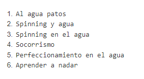
   
2. Mostrar el código de la actividad, título y nivel.

    `//actividad/codigo/text() | //actividad/titulo/text() | //actividad/@nivel`

    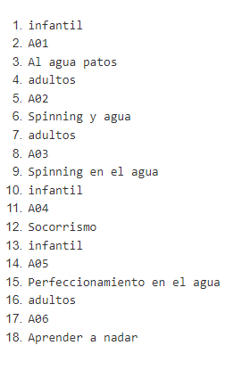
   
3. El primer título de la actividad.
    
    `//actividad[1]/titulo/text()`

    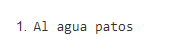
   
4. El último título de la actividad.

    `//actividad[last()]/titulo/text()`

    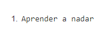
   
5. Todos los elementos descendientes de las actividades infantiles

    `//actividad[@nivel="infantil"]/node()`

    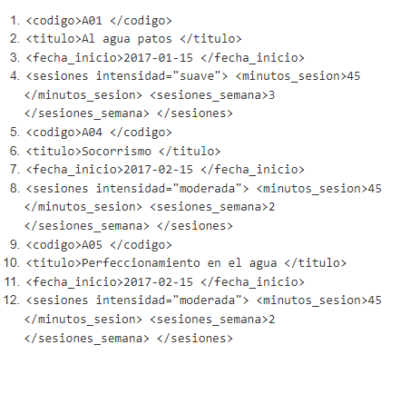
   
6. El nombre de las actividades para adultos.

    `//actividad[@nivel="adultos"]/node()`

    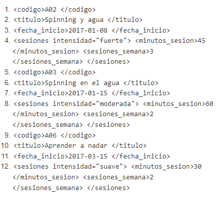
   
7. El nombre de las actividades con dos sesiones semanales

    `//actividad[sesiones/sesiones_semana=2]/titulo/text()`

    Otra forma

    `//actividad[1][sesiones_semana=2]../titulo/text()`

    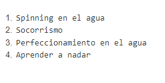
   
8. Número de actividades

    `count(//actividad)`

    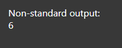
   
9.  Si queremos convertir el resultado a cadena de caracteres, podemos  usar la función string().

    `string(count(//actividad))`

    
    
10.   Cuenta del número de actividades infantiles.   
    
        `count(//actividad[@nivel="infantil"])`

        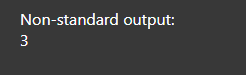
    
11.  Suma de las sesiones semanales de las actividades para adultos.

        `sum(//actividad[@nivel="adultos"]//sesiones_semana)`

        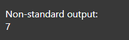
    
12.  Nodos de la actividad de código A06

        `//actividad[codigo="A06"]/node()`

        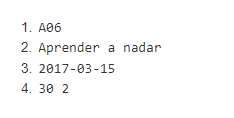
    
13. Duración de las actividades con intensidad fuerte

    `//actividad/sesiones[@intensidad="fuerte"]/minutos_sesion/text()`

    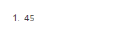
    
14. Mostrar el código de las actividades cuya duración coincide con la duración del 1º actividad.

    `//actividad[sesiones/minutos_sesion/text()=//actividad[1]/sesiones/minutos_sesion/text()]/codigo`

    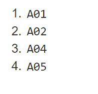
    
15. Título de las actividades del año 2018.

    `//actividad[starts-with(fecha_inicio,"2018")]/titulo`

    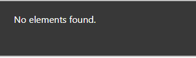
    