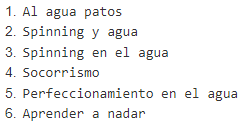
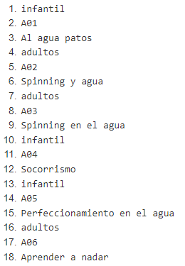
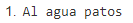
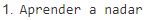
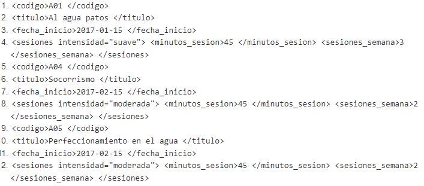
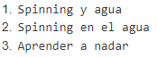
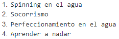
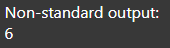
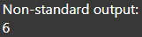
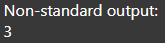

# 1 - GIMNASIO
## Consultas - XPath
Dado el siguientes datos XPath online real-time tester, evaluator and generator for XML & HTML
(xpather.com) se pide realizar las siguientes consultas:

1. Título de las actividades 
   
   `/actividades/actividad/titulo/text()`

   Resultado:
   
   

2. Mostrar el código de la actividad, título y nivel.

   `/actividades/actividad/codigo/text()|/actividades/actividad/titulo/text()|/actividades/actividad/@nivel`

   Resultado:
   
   
   
3. El primer título de la actividad.
   
   `//actividad[1]/titulo/text()`

   Resultado:
   
   

4. El último título de la actividad.
   
   `//actividad[last()]/titulo/text()`

   Resultado:
   
   

5. Todos los elementos descendientes de las actividades infantiles
   
   `//actividad[@nivel="infantil"]/node()`

   Resultado:
   
   
   
6. El nombre de las actividades para adultos.
   
   `//actividad[@nivel="adultos"]/titulo/text()`

   Resultado:
   
   
   
7. El nombre de las actividades con dos sesiones semanales
   
   `//actividad[sesiones/sesiones_semana=2]/titulo/text()`

   Otras formas:

   `//sesiones[sesiones_semana=2]/../titulo/text()`
   `//sesiones_semana[.=2]/../../titulo/text()`

   Resultado:
   
   
   
8. Número de actividades
   
   `count(//actividad)`

   Resultado:
   
   
   
9.  Si queremos convertir el resultado a cadena de caracteres, podemos usar la función string().
   
   `string(count(//actividad))`

   Resultado:
   
   
    
10. Cuenta del número de actividades infantiles.
   
   `count(//actividad[@nivel="infantil"])`

   Resultado:
   
   
    
11. Suma de las sesiones semanales de las actividades para adultos.
   
   `sum(//actividad[@nivel='adultos']//sesiones_semana)`

   Resultado:
   
   
    
12. Nodos de la actividad de código A06.
   
   `//actividad/codigo[.="A06"]/parent::node()`

   Otras formas:

   `//actividad[codigo="A06"]/self::node()`

   Resultado:
   
   
    
13. Duración de las actividades con intensidad fuerte
   
   `//actividad/sesiones[@intensidad="fuerte"]/minutos_sesion/text()`

   Resultado:
   
   
    
14. Mostrar el código de las actividades cuya duración coincide con la duración del 1º actividad.
   
   `//actividad[sesiones/minutos_sesion/text()=//actividad[1]/sesiones/minutos_sesion/text()]/codigo`

   Resultado:
   
   
    
15. Título de las actividades del año 2018.
   
   `//actividad[fecha_inicio>="2018-01-01" and fecha_inicio<="2018-12-31" ]/titulo/text()`
   
   Otras formas:

   `//actividad[starts-with(fecha_inicio,"2018")/titulo/text()`

   Resultado:
   
   