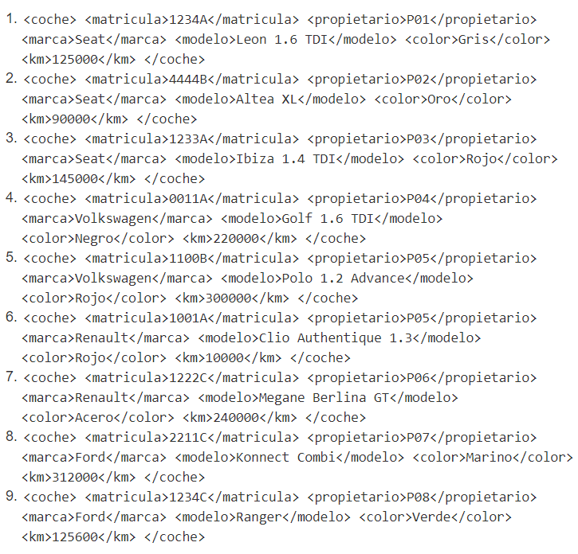
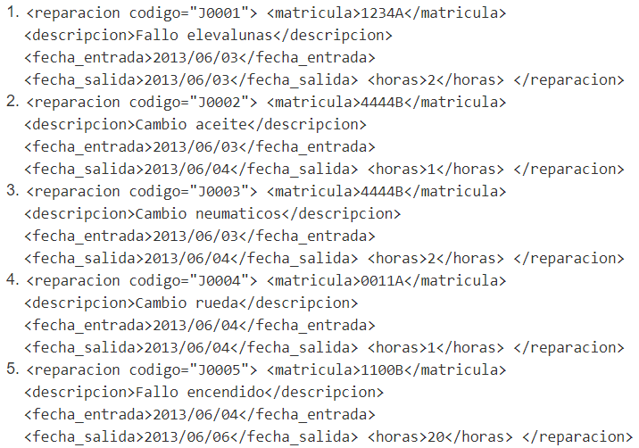
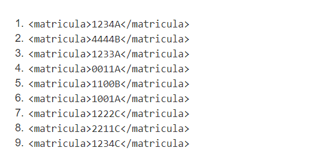
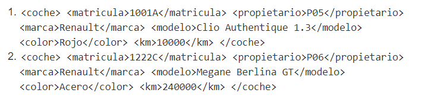
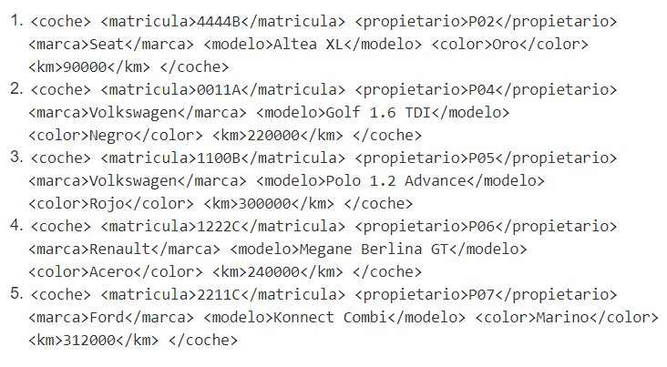
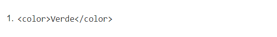
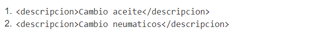

# 1 - GIMNASIO
## Consultas - XPath
Dado el siguientes datos XPath online real-time tester, evaluator and generator for XML & HTML
(xpather.com) se pide realizar las siguientes consultas:

1. Los elementos de cada coche. 
   
   `//garaje/coches/node()`

   Resultado:
   
   

2. Los elementos de cada reparación.

   `//reparaciones/reparacion`

   Resultado:
   
   
   
3. El contenido de La matrícula de los coches. 
   
   `//coches/coche/matricula/text()`

   Resultado:
   
   

4.  Todos los nodos (elementos y contenido) de los coches de la marca Renault. 
   
   `//coches/coche[marca="Renault"]/self::node()`

   Resultado:
   
   

5. Todos los nodos de los coches de más de 200000 km. 
   
   `//coches/coche[km>"200000"]/self::node()`

   Resultado:
   
   
   
6.  El contenido del color del coche de matrícula 1234C. 
   
   `//coches/coche[matricula="1234C"]/color/text()`

   Resultado:
   
   
   
7. El contenido de la descripción de las reparaciones realizadas al coche de matrícula: 4444B.
   
   `//reparaciones/reparacion[matricula="4444B"]/descripcion/text()`

   Resultado:
   
   

8.  El contenido de la descripción de la reparación de código J0005.
   
   ``

   Resultado:
   
   
