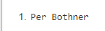
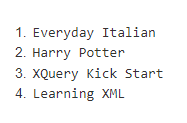
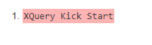

1. Listad los autores de los libros en inglés y el nombre del autor comience por la
letra P.
    `//libro/titulo[@leng="en"]/../autor[starts-with(text(),"P")]/text()`

    
2. Titulo de los libros comprados y los pendientes de recibir
    `//libro[@codigo=(//comprados/codigo|//pendientes/codigo)]/titulo/text()`

    
3. Título de los libros cuyo precio es mayor que el último libro
   `//libro[precio>//libro[last()]/precio]/titulo/text()`

    
4. Título de los libros con más de un autor.
   `//libro[count(autor)>1]/titulo/text()`

    