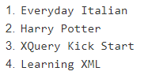

# 3 - CONSULTAS XPATH - EXAMEN
1. Listad los autores de los libros en inglés y el nombre del autor comience por la
letra P.
   
   `//libro[titulo/@leng="en"]/autor[starts-with(.,'P')]/text()`

   Resultado:

   

2. Titulo de los libros comprados y los pendientes de recibir
   
   `//libro[@codigo=(//almacen/comprados/codigo|//almacen/pendientes/codigo)]/titulo/text()`

   Resultado:

   

3. Título de los libros cuyo precio es mayor que el último libro
   
   `//libro[precio>(//libro[last()]/precio)]/titulo/text()`

   Resultado:

   

4. Título de los libros con más de un autor.
   
   `//libro[count(autor)>1]/titulo/text()`

   Resultado:

   

