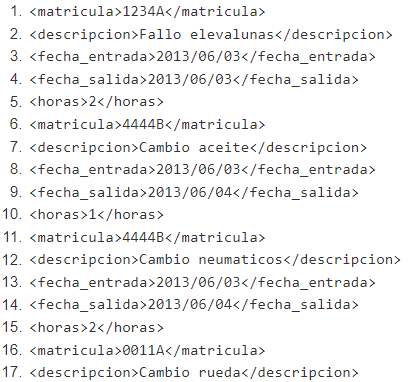

# 2 - COCHES / REPARACIONES 
## Consultas - XPath
Dado el siguientes datos xml2.xml se pide realizar las siguientes consultas en:

1. Los elementos de cada coche.
   
   `//coche/node()`

   Resultado:

   

2. Los elementos de cada reparación.
   
   `/garaje/reparaciones/reparacion/node()`

   Resultado:

   
   
3. El contenido de La matrícula de los coches.
   
   `//matricula/text()`

   Resultado:

   
   
4. Todos los nodos (elementos y contenido) de los coches de la marca Renault.
   
   `//coche[marca='Renault']/*`

   Resultado:

   
   
5. Todos los nodos de los coches de más de 200000 km.
   
   `//coche[km>200000]/*`

   Resultado:

   
   
6. El contenido del color del coche de matrícula 1234C.
   
   `//coche[matricula='1234C']/color/text()`

   Resultado:

   
   
7. El contenido de la descripción de las reparaciones realizadas al coche de matrícula: 4444B.
   
   `//reparacion[matricula='4444B']/descripcion/text()`

   Resultado:

   
   
8. El contenido de la descripción de la reparación de código J0005.
    
    `//reparacion[@codigo='J0005']/descripcion/text()`

    Resultado:

    

9.  Suma de las horas invertidas reparando coches.
    
    `sum(//horas)`

    Resultado:

    
    
10. Número de coches en el documento.
    
    `count(//coche/matricula)`

    Resultado:

    
   
11. Selecciona todos los elementos del primer coche.
    
    `//coche[1]/node()`

    Otra forma:

    `//coche[position()=1]/node()`

    Resultado:

    
   
12. Selecciona todos los elementos de la última reparación.
    
    `//reparacion[last()]/node()`

    Resultado:

    
   
13. Selecciona todos los elementos del coche de la marca Seat con color Rojo.
    
    `//coche[marca='Seat' and color='Rojo']/node()`

    Resultado:

    
   
14. Propietario del coche modelo Polo 1.2 Advance.
    
    `//coche[modelo='Polo 1.2 Advance']/propietario/text()`

    Resultado:

    
   
15. Contenido de la descripción de las reparaciones realizadas con fecha de entrada 2013/06/06.
    
    `//reparacion[fecha_entrada='2013/06/06']/descripcion/text()`

    Resultado:

    
   
16. Seleccionar los coches rojos y grises.
    
    `//coche[color='Gris' or color='Rojo']/node()`

    Resultado:

    
   
17. Número de coches que entraron a reparar el 2013/06/03.
    
    `count(//reparacion[fecha_entrada='2013/06/03']/matricula)`

    Resultado:

    
   
18. Contenido del modelo del propietario P01.
    
    `//coche[propietario='P01']/modelo/text()`

    Resultado:

    
   
19. Código de la reparación con fecha de entrada 2013/06/03.
    
    `//reparacion[fecha_entrada='2013/06/03']/@codigo`

    Resultado:

    
   
20. Suma de las horas de reparación del coche de matrícula 4444B.
    
    `sum(//reparacion[matricula='4444B']/horas)`

    Resultado:

    
   
21. Matrícula de los coches marca Ford y Volkswagen.
    
    `//coche[marca='Ford' or marca='Volkswagen']/matricula/text()`

    Resultado:

    
   
22. El nombre del propietario cuya reparacion es J0001.

    `//coche[matricula=//reparacion[@codigo='J0001']/matricula]/propietario/text()`

    Resultado:

    
   
