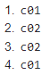

# 3 - UNIVERSIDAD
## Consultas - XPath
Dado el siguientes datos xml03.xml se pide realizar las siguientes consultas en XPath:

1. Nombre de la Universidad:
   
   `universidad/nombre/text()`

   Resultado:

   

2. Pais de la Universidad:
   
   `universidad/pais/text()`

   Resultado:

   

3. Nombres de las Carreras:
   
   `/universidad/carreras/carrera/nombre/text()`

   Resultado:

   

4. Años de plan de estudio de las carreras:
   
   `/universidad/carreras/carrera/plan/text()`

   Resultado:

   

5. Nombres de todos los alumnos:
   
   `/universidad/alumnos/alumno/nombre/text()`

   Resultado:

   

6. Identificadores de todas las carreras:
   
   `/universidad/carreras/carrera/@id`

   Resultado:

   

7. Datos de la carrera cuyo id es c01:
   
   `/universidad/carreras/carrera[@id="c01"]/node()`

   Resultado:

   

8. Centro en que se estudia de la carrera cuyo id es c02:
   
   `/universidad/carreras/carrera[@id="c02"]/centro/text()`

   Resultado:

   

9.  Nombre de las carreras que tengan subdirector:
   
    `/universidad/carreras/carrera[subdirector]/nombre/text()`

    Otra forma:

    `//carrera[subdirector]/nombre/text()`
    `//carrera/child::subdirector/../nombre/text()`
    `//subdirector/../nombre/text()`

    Resultado:

    

10. Nombre de los alumnos que estén haciendo proyecto:
    
    `/universidad/alumnos/alumno[estudios/proyecto]/nombre/text()`

    Otra forma:

    `//alumno[.//proyecto]/nombre/text()`
    `//estudios[proyecto]/../nombre/text()`

    Resultado:

    

11. Códigos de las carreras en las que hay algún alumno matriculado:
    
    `//alumno/estudios/carrera/@codigo`

    Resultado:

    

12. Apellidos y Nombre de los alumnos con beca:
    
    `//alumno[@beca="si"]/(nombre|apellido1|apellido2)/text()`

    Otra forma:

    `concat(//alumno[@beca="si"]/nombre," ",//alumno[@beca="si"]/apellido1," ",//alumno[@beca="si"]/apellido2)`

    Resultado:

    

13. Nombre de las asignaturas de la titulación c04:
    
    `//asignatura[@titulacion="c04"]/nombre/text()`

    Resultado:

    

14. Nombre de las asignaturas de segundo trimestre:
    
    `//asignatura[trimestre="2"]/nombre/text()`

    Resultado:

    

15. Nombre de las asignaturas que no tienen 4 créditos teóricos:
    
    `//asignatura[creditos_teoricos!="4"]/nombre/text()`

    Resultado:

    

16. Código de la carrera que estudia el último alumno:
    
    `//alumno[last()]/estudios/carrera/@codigo`

    Resultado:

    

17. Código de las asignaturas que estudian mujeres:
    
    `//alumno[sexo="Mujer"]/estudios/asignaturas/asignatura/@codigo`

    Otra forma:

    `//alumno[sexo="Mujer"]//asignatura/@codigo`

    Resultado:

    

18. Nombre de los alumnos que matriculados en la asignatura a02:
    
    `//alumno[estudios/asignaturas/asignatura/@codigo="a02"]/nombre/text()`

    Resultado:

    

19. Códigos de las carreras que estudian los alumnos matriculados en alguna asignatura.
    
    `//alumno/estudios/asignaturas/asignatura/../../carrera/@codigo`

    Otra forma:

    `//asignatura/../../carrera/@codigo`

    Resultado:

    

20. Apellidos de todos los hombres:
    
    `//alumno[sexo="Hombre"]/(apellido1|pellido2)`

    Resultado:

    

21. Nombre de la carrera que estudia Víctor Manuel:
    
    `//carrera[@id=//alumno[nombre="Victor Manuel"]//carrera/@codigo]/nombre/text()`

    Resultado:

    

22. Nombre de las asignaturas que estudia Luisa:
    
    `//asignatura[@id=//alumno[nombre="Luisa"]//asignatura/@codigo]/nombre/text()`

    Resultado:

    

23. Primer apellido de los alumnos matriculados en Ingeniería del Software:
    
    `//alumno[.//asignatura/@codigo=//asignatura[nombre="Ingeniería del Software"]/@id]/apellido1`

    Resultado:

    

24. Nombre de las carreras que estudian los alumnos matriculados en la asignatura Tecnología de los Alimentos:
    
    `//carrera[@id=//alumno/estudios[//asignatura/@codigo=//asignatura[nombre="Tecnología de los Alimentos"]/@id]/carrera/@codigo]/nombre/text()`

    Resultado:

    

25.  Nombre de los alumnos matriculados en carreras que no tienen subdirector:
        
        `//alumno[not(@codigo=//carrera[subdirector]/@codigo)]/nombre/text()`

        Resultado:

        

26.  Nombre de los alumnos matriculados en asignaturas con 0 créditos prácticos y que estudien la carrera de I.T. Informática
        
        `//alumno[.//asignatura/@codigo=//asignatura[creditos_practicos=0]/@id][.//carrera/@codigo=//carrera[nombre='I.T. Informática']/@id]/nombre/text()`

        Resultado:

        

27.  Nombre de los alumnos que estudian carreras cuyos planes son anteriores a 2002.
        
        `//alumno/estudios/carrera[@codigo=//carreras/carrera[plan<2002]/@id]/../../nombre/text()`

        Resultado:

        
