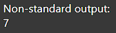

# 4 - MEDIATECA
## Consultas - XPath
Dado el siguientes datos xml04.xml se pide realizar las siguientes consultas en XPath:

1. Total de usuarios registrados en 2014
   
   `sum(//row[@Anyo=2014]/@Usuarios_registrados)`

   Resultado:

   

2. Usuarios registrados en 2015 que son "Seguidores de las redes Twitter o Facebook"
   
   `sum(//row[@Anyo=2015 and (@Concepto="Seguidores Facebook" or @Concepto="Seguidores Twitter")]/@Usuarios_registrados)`

   Otra forma:

   `sum(//row[@Anyo=2015][@Concepto="Seguidores Facebook" or @Concepto="Seguidores Twitter"]/@Usuarios_registrados)`

   Resultado:

   

3. Contar el número de conceptos que existen en 2016
   
   `count(//row[@Anyo=2016]/@Concepto)`

   Resultado:

   

4. Calcular la media de usuarios registrados, sabiendo que no existe en XPath 1.0 la función media y que
para dividir utilizamos el operador div.
   
   `sum(//row/@Usuarios_registrados) div count(//row)`

   Resultado:

   

5. Mostrar todos los atributos de row cuando los usuarios registrados son mayores que la media de todos
los usuarios
   
   `//row[@Usuarios_registrados>(sum(//row/@Usuarios_registrados) div count(//row))]/@*`

   Resultado:

   

6. Total de usuarios registrados el último año almacenado en el fichero xml, siendo el último año un dato
calculado.
   
   `sum(//row/@Anyo[last()]/../@Usuarios_registrados)`

   Resultado:

   

7. Comparar los usuarios registrados el primer año con los del último año, dando como resultado un valor
booleano (true o false).
   
   `(//row[last()]/@Usuarios_registrados)>(//row[1]/@Usuarios_registrados)`

   Resultado:

   

8. Contar el número de conceptos distintos existen los datos del fichero XML.
   
   `count(distinct-values(//@Concepto))`

   Resultado:

   

9. Listar todos los atributos de aquellas filas (row) que no contienen ni la palabra Twitter ni Facebook.
   
   `//row[not(contains(@Concepto, 'Facebook') or contains(@Concepto, 'Twitter'))]/@*`

   Resultado:

   

10. Selecciona todos los elementos row que contienen el atributo “Concepto"
    
    `//row[@Concepto]`

    Resultado:

    
