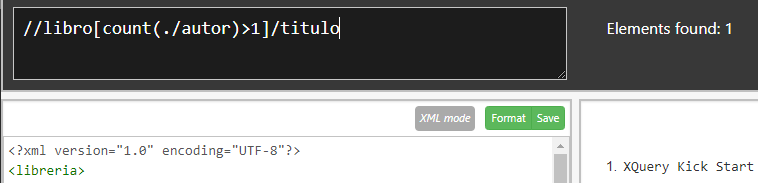

1. Listad los autores de los libros en inglés y el nombre del autor comience por la letra P.
   
2. Titulo de los libros comprados y los pendientes de recibir
   
3. Título de los libros cuyo precio es mayor que el último libro
   
4. Título de los libros con más de un autor.
   