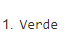

1. Los elementos de cada coche.
   
   
2. Los elementos de cada reparación.
   
   
3. El contenido de La matrícula de los coches.
   
   
4. Todos los nodos (elementos y contenido) de los coches de la marca Renault. 
   
5. Todos los nodos de los coches de más de 200000 km. 
   
6. El contenido del color del coche de matrícula 1234C.
    
7. El contenido de la descripción de las reparaciones realizadas al coche de matrícula: 4444B.
   
8. El contenido de la descripción de la reparación de código J0005.
   
   
9.  Suma de las horas invertidas reparando coches. 
    
10. Número de coches en el documento.
    
11. Selecciona todos los elementos del primer coche.
    
12. Selecciona todos los elementos de la última reparación.
    
13. Selecciona todos los elementos del coche de la marca Seat con color Rojo. 
    
14. Propietario del coche modelo Polo 1.2 Advance. 
    
15. Contenido de la descripción de las reparaciones realizadas con fecha de entrada 2013/06/06.
    
16. Seleccionar los coches rojos y grises. 
    
17. Número de coches que entraron a reparar el 2013/06/03. 
    
18. Contenido del modelo del propietario P01.
     
19. Código de la reparación con fecha de entrada 2013/06/03. 
    
20. Suma de las horas de reparación del coche de matrícula 4444B.
    
21. Matrícula de los coches marca Ford y Volkswagen.
    
22. El nombre del propietario cuya matricula es J00.
    