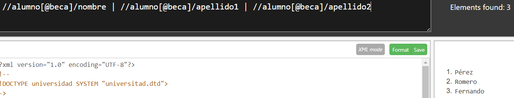

1. Nombre de la Universidad:

1. Pais de la Universidad:

1. Nombres de las Carreras:

1. Años de plan de estudio de las carreras:

1. Nombres de todos los alumnos:

1. Identificadores de todas las carreras:

1. Datos de la carrera cuyo id es c01:

1. Centro en que se estudia de la carrera cuyo id es c02:

1. Nombre de las carreras que tengan subdirector:

1.  Nombre de los alumnos que estén haciendo proyecto:

1.  Códigos de las carreras en las que hay algún alumno matriculado:

1.  Apellidos y Nombre de los alumnos con beca:

1.  Nombre de las asignaturas de la titulación c04:

1.  Nombre de las asignaturas de segundo trimestre:

1.  Nombre de las asignaturas que no tienen 4 créditos teóricos:

1.  Código de la carrera que estudia el último alumno:

1.  Código de las asignaturas que estudian mujeres:

1.  Nombre de los alumnos que matriculados en la asignatura a02:

1.  Códigos de las carreras que estudian los alumnos matriculados en alguna asignatura.

1.  Apellidos de todos los hombres:

1.  Nombre de la carrera que estudia Víctor Manuel:

1.  Nombre de las asignaturas que estudia Luisa:

1.  Primer apellido de los alumnos matriculados en Ingeniería del Software:

1.  Nombre de las carreras que estudian los alumnos matriculados en la asignatura Tecnología de los
Alimentos:

1.  Nombre de los alumnos matriculados en carreras que no tienen subdirector:

1.  Nombre de los alumnos matriculados en asignaturas con 0 créditos prácticos y que estudien la carrera
de I.T. Informática

1.  Nombre de los alumnos que estudian carreras cuyos planes son anteriores a 2002
