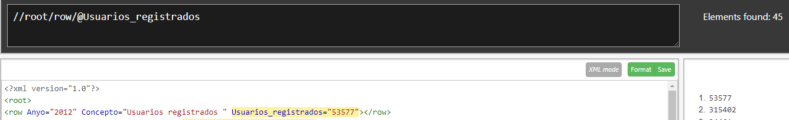

1. Total de usuarios registrados en 2014
   
2. Usuarios registrados en 2015 que son "Seguidores de las redes Twitter o Facebook"
   
3. Contar el número de conceptos que existen en 2016
4. Calcular la media de usuarios registrados, sabiendo que no existe en XPath 1.0 la función media y que
para dividir utilizamos el operador iv.
1. Mostrar todos los atributos de row cuando los usuarios registrados son mayores que la media de todos
los usuarios
1. Total de usuarios registrados el último año almacenado en el fichero xml, siendo el último año un dato
calculado.
1. Comparar los usuarios registrados el primer año con los del último año, dando como resultado un valor
booleano (true o false).
1. Contar el número de conceptos distintos existen los datos del fichero XML.
2. Listar todos los atributos de aquellas filas (row) que no contienen ni la palabra Twitter ni Facebook.
3.  Selecciona todos los elementos row que contienen el atributo “Concepto"