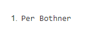
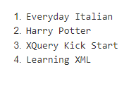
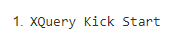
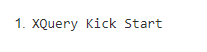

# 1-Libreria
## consultas XPath
1. Listad los autores de los libros en inglés y el nombre del autor comience por la
letra P.
`/libreria/libro/titulo[@leng="en"]/text()`

 
2. Titulo de los libros comprados y los pendientes de recibir
`/libreria/almacen/comprados/codigo/../libro/titulo/text()`

 
3. Título de los libros cuyo precio es mayor que el último libro
``

 
1. Título de los libros con más de un autor
`)`

 