# 1-Gimnasio
## consultas XPath
1. Título de las actividades
   
  `/actividades/actividad/titulo/text()`

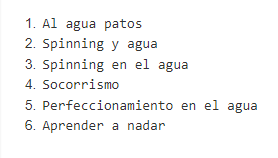

2. Mostrar el código de la actividad, título y nivel.
    `/actividades/actividad/codigo/text()|/actividades/actividad/titulo/text()|/actividades/actividad/@nivel`

    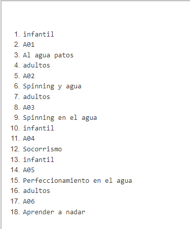

3. El primer título de la actividad.
   
    `//actividad[1]/titulo`

    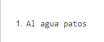

4. El último título de la actividad.
   
`//actividad[last()]/titulo/text()`

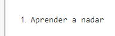

5. Todos los elementos descendientes de las actividades infantiles
   
`//actividad[@nivel="infantil"]/node()`

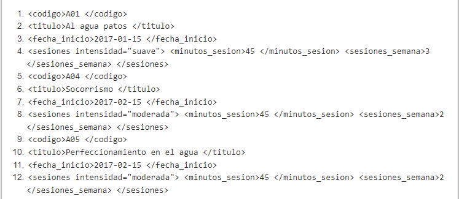

6. El nombre de las actividades para adultos.
   
`//actividad[@nivel="adultos"]/titulo/text()`

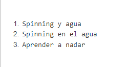

7. El nombre de las actividades con dos sesiones semanales
   
`//actividad[sesiones/sesiones_semana=2]/titulo/text()`
`//sesiones[sesiones_semana=2]/../titulo/text()`
`//sesiones_semana[.=2]/../../titulo/text()`

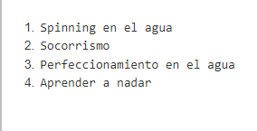

8. Número de actividades
   
`count(//actividad)`

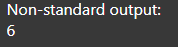

9.  Si queremos convertir el resultado a cadena de caracteres, podemos usar la función string().
   
`string(count(//actividad))`

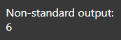

10.   Cuenta del número de actividades infantiles.
   
`count(//actividad[@nivel="infantil"])`

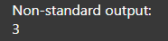

11.  Suma de las sesiones semanales de las actividades para adultos.
   
`sum(//actividad[@nivel="adultos"]/sesiones/sesiones_semana)`
`sum(//actividad[@nivel="adultos"]//sesiones_semana)`

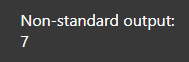

12.   Nodos de la actividad de código A06.
    
`/actividades/actividad/codigo[.="A06"]/parent::node()`
`//actividad[codigo="A06"]/node()`

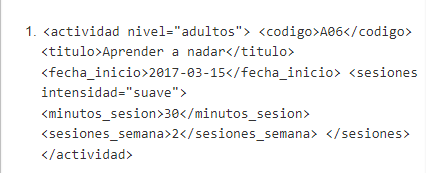

13. Duración de las actividades con intensidad fuerte

`//actividad/sesiones[@intensidad="fuerte"]/minutos_sesion/text()`

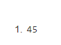

14.  Mostrar el código de las actividades cuya duración coincide con la duración del 1º actividad.

`//actividad[sesiones/minutos_sesion/text()=//actividad[1]/sesiones/minutos_sesion/text()]/codigo`

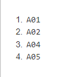

15.  Título de las actividades del año 2018

`//actividad[fecha_inicio>="2018-01-01" and fecha_inicio<="2018-12-31"]/titulo/text()`

