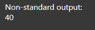

# 2-Garaje
## consultas XPath
1. Los elementos de cada coche.
   `/garaje/coches/node()`

    
2. Los elementos de cada reparación. 
   `/garaje/reparaciones/node()`

   
3. El contenido de La matrícula de los coches. 
   `//matricula/text()`

   
4. Todos los nodos (elementos y contenido) de los coches de la marca Renault. 
   `//coche[marca="Renault"]/*`
   
5. Todos los nodos de los coches de más de 200000 km. 
   `//coche[km>200000]/*`
   
6. El contenido del color del coche de matrícula 1234C.
   `//coche[matricula='1234C']/color/text()` 
   
7. El contenido de la descripción de las reparaciones realizadas al coche de matrícula: 4444B.
   `//reparacion[matricula='4444B']/descripcion/text()`
   
8. El contenido de la descripción de la reparación de código J0005.
   `//reparacion[@codigo='J0005']/descripcion/text()`
   
9.  Suma de las horas invertidas reparando coches. 
    `sum(//horas)`
    
10. Número de coches en el documento.
    `count(//coche/matricula)`
    
11. Selecciona todos los elementos del primer coche.
    `//coche[1]/node()`
    `//coche[position()=1]/node()`
    
12. Selecciona todos los elementos de la última reparación.
  `//reparacion[last()]/node()`
  
13.   Selecciona todos los elementos del coche de la marca Seat con color Rojo. 
    `//coche[marca='Seat' and color='Rojo']/node()`
    
14.   Propietario del coche modelo Polo 1.2 Advance.
    `//coche[modelo='Polo 1.2 Advance']/propietario/text()` 
    
15.   Contenido de la descripción de las reparaciones realizadas con fecha de entrada 2013/06/06.
    `//reparacion[fecha_entrada='2013/06/06']/descripcion/text()`
    
16.   Seleccionar los coches rojos y grises. 
    `//coche[color='Gris' or color='Rojo']/node()`
    
17.   Número de coches que entraron a reparar el 2013/06/03.
    `count(//reparacion[fecha_entrada='2013/06/03']/matricula)` 
    
18.   Contenido del modelo del propietario P01.
    `//coche[propietario='P01']/modelo/text()` 
    
19.   Código de la reparación con fecha de entrada 2013/06/03.
    `//reparacion[fecha_entrada='2013/06/03']/@codigo`
     
20.   Suma de las horas de reparación del coche de matrícula 4444B. 
    `sum(//reparacion[matricula='4444B']/horas)`
    
21.   Matrícula de los coches marca Ford y Volkswagen.
    `//coche[marca='Ford' or marca='Volkswagen']/matricula/text()`
    
22. Nombre del propietario del coche de la reparación J0001
    `//coche[matricula=//reparacion[@codigo='J0001']/matricula]/propietario/text()`
    