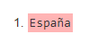

# Unidad 5.3 Universidad

1. Nombre de la Universidad:
   `/universidad/nombre/text()`

    
2. Pais de la Universidad:
   `/universidad/pais/text()`

    
3. Nombres de las Carreras:
   `/universidad/carreras/carrera/nombre/text()`

    
4. Años de plan de estudio de las carreras:
   `/universidad/carreras/carrera/plan/text()`

    
5. Nombres de todos los alumnos:
   `/universidad/alumnos/alumno/nombre/text()`

    
6. Identificadores de todas las carreras:
   `/universidad/carreras/carrera/@id)`

    
7. Datos de la carrera cuyo id es c01:
   `/universidad/carreras/carrera[@id='c01']/node()`

    
8. Centro en que se estudia de la carrera cuyo id es c02:
   `/universidad/carreras/carrera[@id='c02']/centro/text()`

    
9.  Nombre de las carreras que tengan subdirector:
    `/universidad/carreras/carrera[subdirector]/nombre/text()`
    `//carrera[subdirector]/nombre/text()`
    `//carrera/child::subdirector/../nombre/text()`
    `//subdirector/../nombre/text()`

   
10. Nombre de los alumnos que estén haciendo proyecto:
   `/universidad/alumnos/alumno[estudios/proyecto]/nombre/text()`
   `//alumno[.//proyecto]/nombre/text()`
   `//estudios[proyecto]/../nombre/text()`
   `//estudios/proyecto/../../nombre/text()`

    
11. Códigos de las carreras en las que hay algún alumno matriculado:
    `//alumno/estudios/carrera/@codigo`

   
12. Apellidos y Nombre de los alumnos con beca:
    `concat(//alumno[@beca="si"]/nombre," ",//alumno[@beca="si"]/apellido1," ",//alumno[@beca="si"]/apellido2)`

   
13. Nombre de las asignaturas de la titulación c04:
    `//asignatura[@titulacion="c04"]/nombre/text()`

   
14. Nombre de las asignaturas de segundo trimestre:
    `//asignatura[trimestre="2"]/nombre`

   
15. Nombre de las asignaturas que no tienen 4 créditos teóricos:
    `//asignatura[creditos_teoricos!="4"]/nombre/text()`

   
16. Código de la carrera que estudia el último alumno:
    `//alumno[last()]/estudios/carrera/@codigo`

   
17. Código de las asignaturas que estudian mujeres:
    `//alumno[sexo="Mujer"]/estudios/asignaturas/asignatura/@codigo`

   
18. Nombre de los alumnos que matriculados en la asignatura a02:
    `//alumno[estudios/asignaturas/asignatura/@codigo="a02"]/nombre/text()`

   
19. Códigos de las carreras que estudian los alumnos matriculados en alguna asignatura.
    `//alumno//asignatura/../../carrera/@codigo`

   
20. Apellidos de todos los hombres:
    `//alumno[sexo="Hombre"]/(apellido1 | apellido2)`

   
21. Nombre de la carrera que estudia Víctor Manuel:
    `//carrera[@id=//alumno[nombre="Victor Manuel"]//carrera/@codigo]/nombre/text()`

   
22. Nombre de las asignaturas que estudia Luisa:
    `//asignatura[@id=//alumno[nombre="Luisa"]//asignatura/@codigo]/nombre/text()`

   
23. Primer apellido de los alumnos matriculados en Ingeniería del Software:
    `//alumno[.//asignatura/@codigo=//asignatura[nombre="Ingeniería del Software"]/@id]/apellido1/text()`

   
24. Nombre de las carreras que estudian los alumnos matriculados en la asignatura Tecnología de los Alimentos:
    ``

   
25. Nombre de los alumnos matriculados en carreras que no tienen subdirector:
    `//alumno[estudios/carrera/@codigo=//carrera[not(subdirector)]/@id]/nombre/text()`

   
26. Nombre de los alumnos matriculados en asignaturas con 0 créditos prácticos y que estudien la carrera de I.T. Informática
    ``

   
27.  Nombre de los alumnos que estudian carreras cuyos planes son anteriores a 2002
    `//alumno[estudios/carrera/@codigo=//carrera[plan<2002]/@id]/nombre/text()`

   
